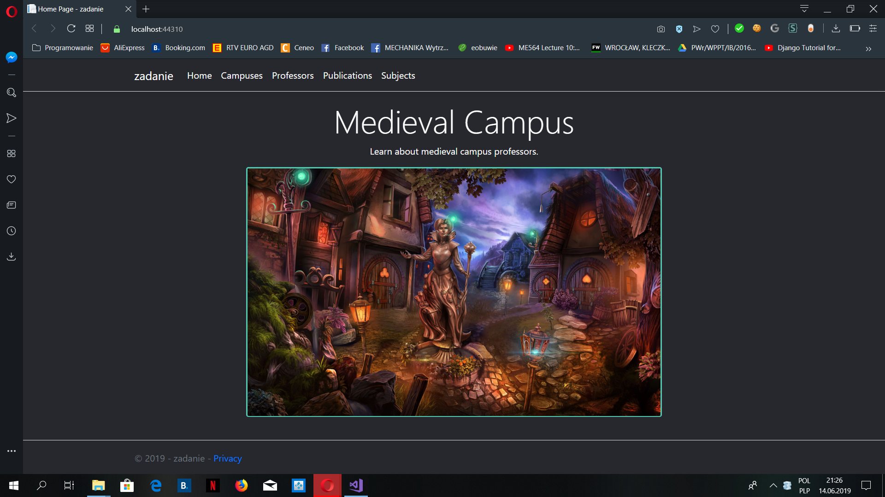
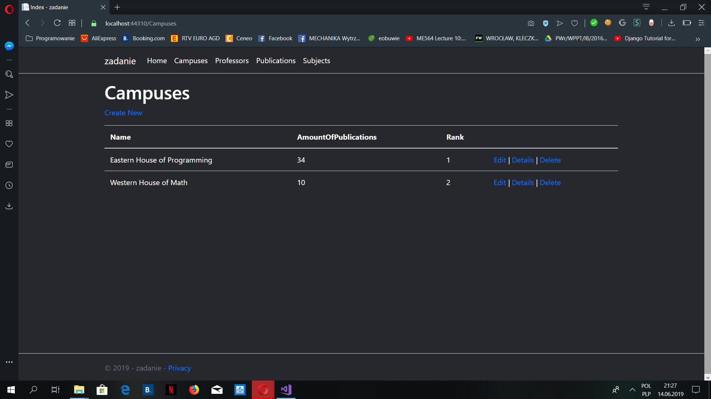

# Medieval Students EntityFramework

## About the Project

### Part 7
This is the latest enlargement of my game: "Medieval Students" created in C #. 
These time I added Web app, which allows users to check info about medieval 
professors and campuses. They could also enter new info. Have fun! 

## Author
Miłosz Gajowczyk

