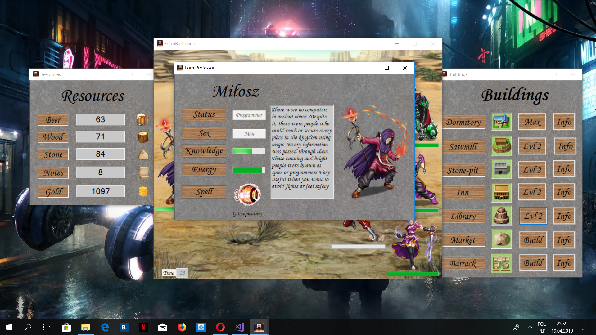

# Medieval Students

## About the Project

### Part 1
This is a simple game about medieval students. Your main purpose is
to build the campus and to avoid the situation when you don't have 
any beer or student in the area of campus. You have to be fast because 
the attacks of enemies from other universities are pretty frequent. 
Your village is close to the river so the threat of flood is also 
one of the obstacles on the way to your perfect campus. 
Some of the buildings could be helpful in avoiding those situations. 
You could read about it in buildings form. You should check
amount of beer every time when you lost student. Beer production 
is connected with amount of students and every death could affect 
beer counter in significant way - making resultant counter negative, 
what could easily lead to game over. Have fun! 

### Part 2
Every self-respecting medieval game should have a battle mode. From now you 
could start the game by choosing your professor's character. Every day at 10:00 
you have to struggle with your students during lectures. Winning will give you 
1500 points, but it's not that easy, especially with some professors. 
Remember that lose will cost you 50 percent of your beer supplies.
Fortunately, even when you lose you could earn some extra points. 
All you have to do is solve the additional task.

## Author
Miłosz Gajowczyk

