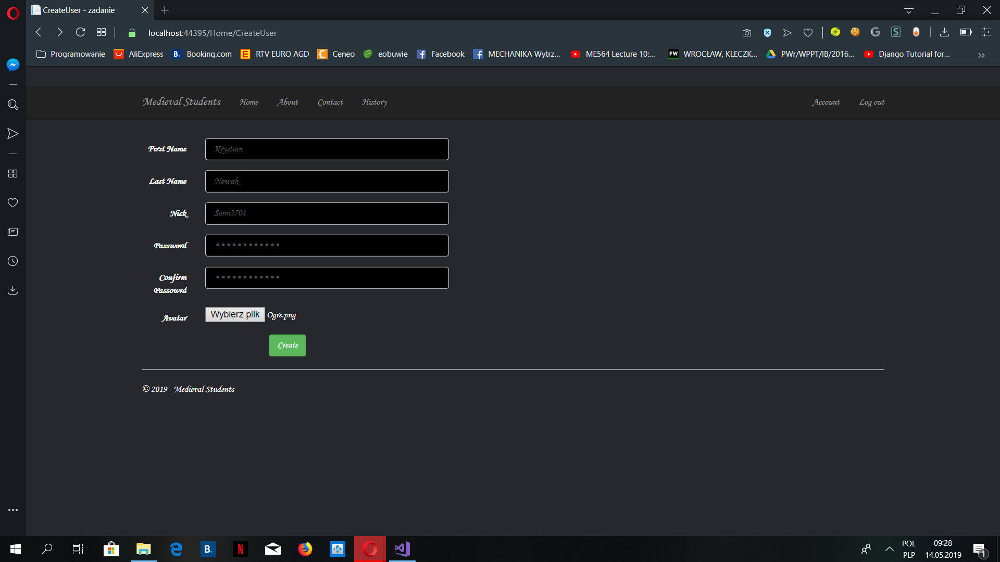
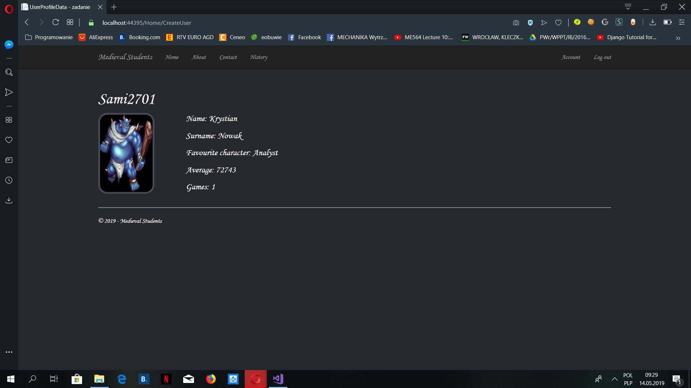
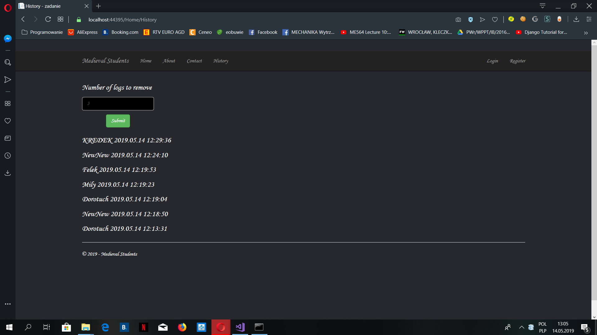

# Medieval Students Server Site

## About the Project

### Part 4
This is a simple server site created as an enlargement 
to my game: "Medieval Students" created in C #. 
The server is connected with the game so you could 
check your game statistic with the same nickname, 
you use in the game (projects share files by Azure,
server data is always one start up behind the game).
You could also create an account with new nick, the 
statistic will not show anything then, but later every 
game with this nickname would be assigned to that account. 
You could send 3 other POST requests. First is for registration, 
second for logging in. The third one allows 
for removing logs history.  Have fun!

## Author
Miłosz Gajowczyk

