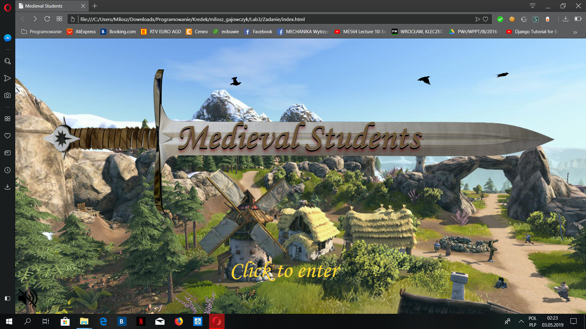
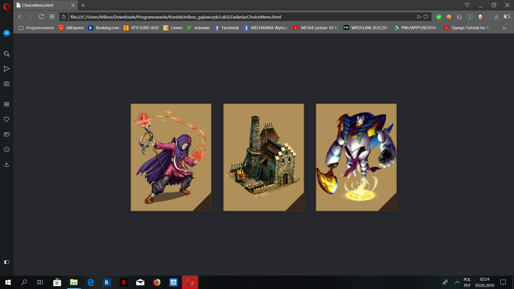
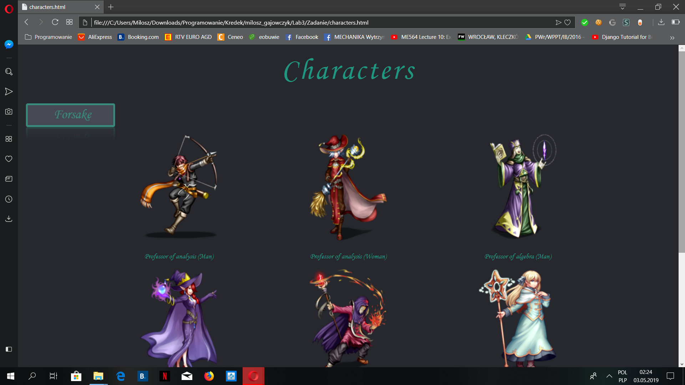
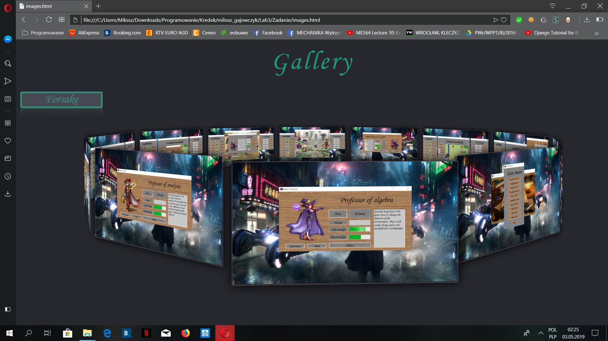
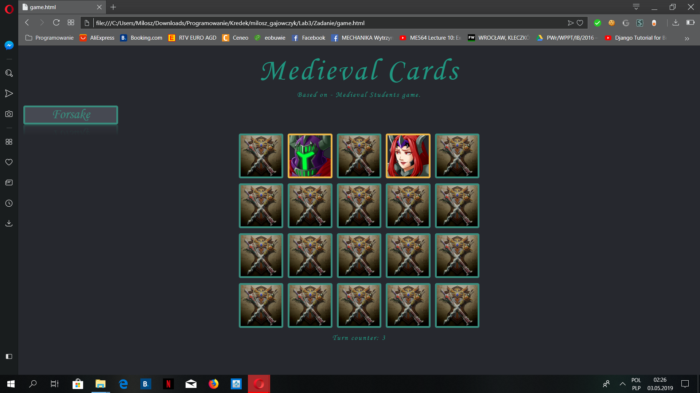

# Medieval Students Site

## About the Project

### Part 3
This is a simple site created as an enlargement to my game: 
"Medieval Students" created in C#. The site is checked with 
Opera, Chrome, Mozilla, and Edge. It should work fine with Safari,
but not every element is checked for this particular browser. 
The index page was created only for devices with the big screen, 
animations performed on a smaller screen wouldn't be clear enough. 
The characters page is made with bootstrap. Other three pages 
are parameterized. On one of the pages, 
you could play a simple memory game. Have fun!

## Author
Miłosz Gajowczyk

