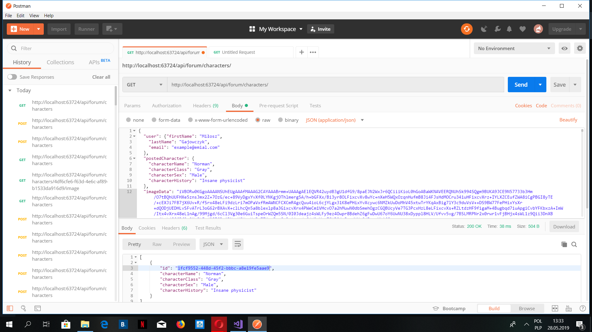
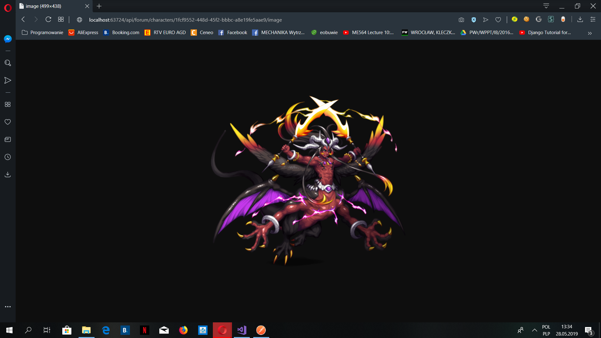

# Medieval Students Web Api

## About the Project

### Part 6
This is the latest enlargement of my game: "Medieval Students" created in C #. 
These time I added web API where users could upload their propositions of new characters
and report new issues, which should be resolved. You could also upload an image 
of the character if you encode it to Base64 format. Have fun! 

## Author
Miłosz Gajowczyk

